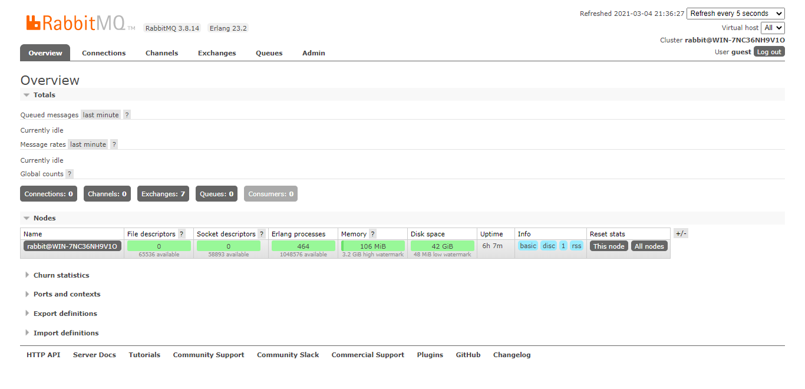

<h1 align="center">RabbitMQ</h1>

## What's it?
The most widely deployed open source message broker.

## How to install?
- [Access this link](https://www.rabbitmq.com/download.html)
- Pay attention to the requirements, such as Erlang.

## Dashboard
- Run on terminal: `rabbitmq-plugins enable rabbitmq_management`
- Access on browser: http://localhost:15672/#/
- Type the default credentials (login and password are equal to 'guest' )
- You should get the final result:

## Basic commands
### Stop rabbitmq server
`rabbitmqctl stop_app` 
### Start rabbitmq server
`rabbitmqctl start_app` 
### Reset rabbitmq server
`rabbitmqctl reset`  
Obs: be careful, it deletes every past configuration.

### Add user to rabbitmq management area with full permision granted
`rabbitmqctl add_user <login> <password>`  
`rabbitmqctl set_user_tags <login> administrator`  
`rabbitmqctl set_permissions -p / <login> ".*" ".*" ".*"`  
